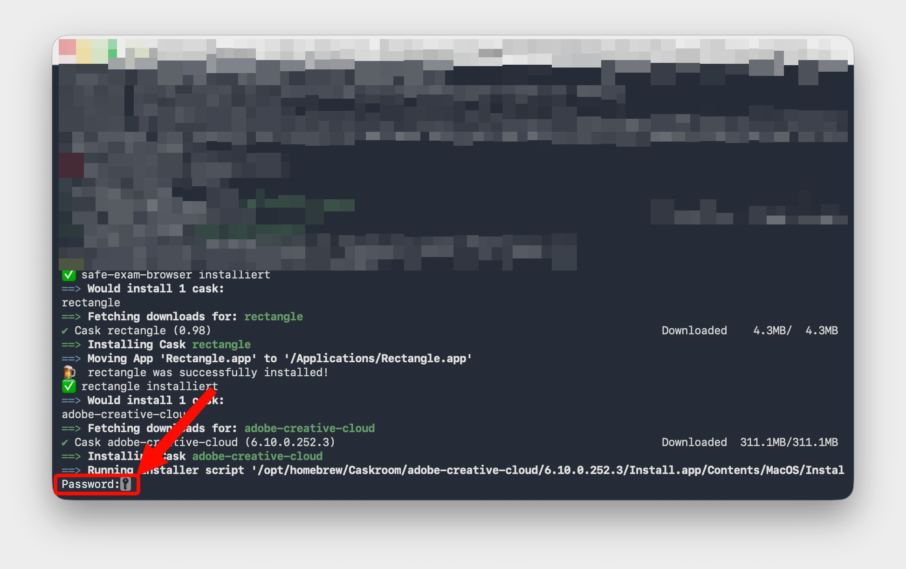

# HMS Schnellinstallation

Diese Schnellinstallation ist speziell auf die Bedürfnisse der Handelsmittelschule (HMS) zugeschnitten und enthält alle Programme, die für die meisten Fachschaften relevant sind. Sie bietet eine effiziente Möglichkeit, die benötigte Software mit minimalem Aufwand zu installieren.

Die Codeblöcke können einfach kopiert werden, indem Sie auf das Symbol (📋) im oberen rechten Teil des Code-Blocks klicken. Danach können Sie den Code-Block per Cmd+V / Ctrl+V im Terminal bzw. PowerShell einfügen und mit Enter ausführen.

Die Schnellinstallation kann je nach System und Internetverbindung einige Minuten bis zu über einer Stunde dauern.

---

## Windows (winget)

Öffnen Sie PowerShell als Administrator und führen Sie den gesamten Block aus.

> **Hinweis:** Beim Einfügen des Codeblocks kann PowerShell aus Sicherheitsgründen nachfragen, ob der Text wirklich eingefügt werden soll. Wählen Sie in diesem Fall **„Trotzdem einfügen“**. Während der Installation kann zudem die Windows-Abfrage **„Möchten Sie zulassen, dass durch diese App Änderungen an Ihrem Gerät vorgenommen werden?“** erscheinen. Bestätigen Sie diese mit **„Ja“**, damit die Installation fortgesetzt wird.

> 🛠️ **Problemlösung bei winget-Fehlern (z. B. Zertifikatsfehler):**  
> Falls `winget` beim Herunterladen von Paketen abbricht oder Zertifikatsfehler anzeigt, führen Sie folgenden Befehl in der PowerShell aus:
> ```powershell
> winget settings --enable BypassCertificatePinningForMicrosoftStore
> ```

```powershell
Write-Host "========================================" -ForegroundColor Cyan
Write-Host " HMS-Schnellinstallation – Windows"     -ForegroundColor Cyan
Write-Host "========================================" -ForegroundColor Cyan
Write-Host ""

$apps = @(
  "ETHZurich.SafeExamBrowser",
  "Adobe.CreativeCloud",
  "BlenderFoundation.Blender",
  "iGEM.MEGA.12",
  "GraphPad.Prism",
  "GeoGebra.Classic",
  "Musescore.Musescore"
)

$ok = 0
$fail = 0

foreach ($id in $apps) {
  Write-Host "Installiere $id ..."
  winget install --id $id -e --accept-package-agreements --accept-source-agreements --silent
  if ($LASTEXITCODE -eq 0) {
    Write-Host "✅ $id" -ForegroundColor Green
    $ok++
  } else {
    Write-Host "❌ $id" -ForegroundColor Red
    $fail++
  }
}

Write-Host ""
Write-Host "========================================" -ForegroundColor Cyan
Write-Host " Ergebnis: $ok ✅  erfolgreich, $fail ❌  fehlgeschlagen" -ForegroundColor Cyan
Write-Host "========================================" -ForegroundColor Cyan
```

---

## macOS (Homebrew)

> ⚠️ **Wichtig:** Diese Schnellinstallation funktioniert nur mit installiertem Homebrew. Falls Homebrew noch nicht installiert ist, zuerst [Homebrew einrichten](../homebrew.html).

Öffnen Sie Terminal und führen Sie den gesamten Block aus.

Sie müssen sich gegebenenfalls durch die Eingabe Ihres Passworts authentifizieren. Das gewöhnliche Passwort Ihres MacOS-Benutzerkontos ist gemeint, nicht das Apple-ID-Passwort.



```bash
echo "========================================"
echo " HMS-Schnellinstallation – macOS"
echo "========================================"
echo ""

# Homebrew prüfen
if ! command -v brew >/dev/null 2>&1; then
  echo "❌ Homebrew fehlt. Bitte zuerst installieren: https://brew.sh"
  exit 1
fi

brew update

# Casks
casks=(
  microsoft-office
  microsoft-teams
  safe-exam-browser
  rectangle
  adobe-creative-cloud
  blender
  mega
  prism
  geogebra
  musescore
)

ok=0
fail=0

install_cask () {
  local pkg="$1"
  if brew list --cask "$pkg" >/dev/null 2>&1; then
    echo "✅ $pkg bereits installiert"
    ok=$((ok + 1))
  elif brew install --cask "$pkg"; then
    echo "✅ $pkg installiert"
    ok=$((ok + 1))
  else
    echo "❌ $pkg fehlgeschlagen"
    fail=$((fail + 1))
  fi
}

echo "--- Casks ---"
for p in "${casks[@]}"; do install_cask "$p"; done

echo ""
echo "========================================"
echo " Ergebnis: $ok ✅  erfolgreich, $fail ❌  fehlgeschlagen"
echo "========================================"
```

---

## Problemlösung: MEGA lässt sich nicht installieren

Erscheint bei der Installation von MEGA der Hinweis, dass **Rosetta 2** benötigt wird, führen Sie diesen Befehl im Terminal aus:

```bash
sudo softwareupdate --install-rosetta --agree-to-license
```

Installieren Sie MEGA danach erneut:

```bash
brew install --cask mega
```
