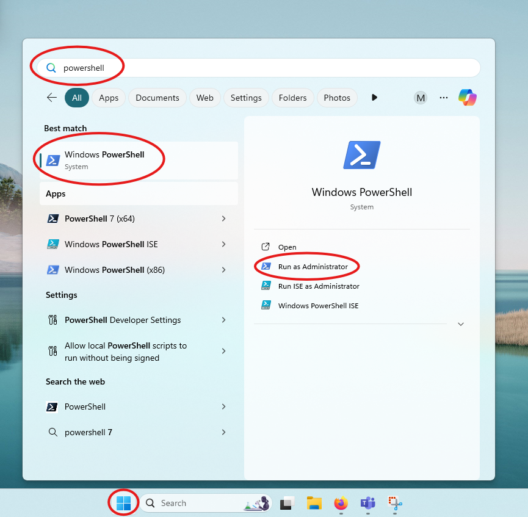
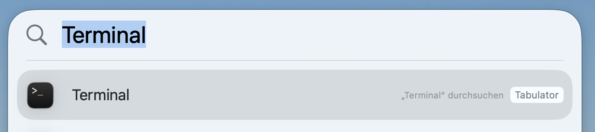

# Software-Installation KST FDü

Diese Seite enthält Installationsanleitungen für alle an der Kantonsschule Dübendorf (KST FDü) verwendeten Programme, geordnet nach Fachschaft.

Wo immer möglich werden Anleitungen für **Windows** (mit winget) und **macOS** (mit Homebrew) bereitgestellt. Befehle können direkt aus den Codeblöcken kopiert werden.

## Hinweise

- **Windows:** Befehle müssen in **PowerShell als Administrator** ausgeführt werden. Bei Problemen mit `winget` beachten Sie die [WinGet Problemlösung](docs/winget.html):

- **macOS:** ⚠️ **Wichtig:** Die Anleitungen funktionieren nur mit installiertem Homebrew. Falls Homebrew noch nicht installiert ist, zuerst die Seite [Homebrew einrichten](docs/homebrew.html) befolgen. Befehle müssen in der **Terminal-App** ausgeführt werden. Öffnen Sie ein **Terminal**, indem Sie die Spotlight-Suche mit Cmd + Leertaste öffnen, Terminal eingeben und mit Enter bestätigen.

## Kurzzeitgymnasium (KG)
Schnelle Installation und Verwaltung für das Kurzzeitgymnasium:

- [⭐️ Schnellinstallation (Windows & macOS)](docs/kg/schnellinstallation.html)
- [⭐️ Installationscheck (Windows & macOS)](docs/kg/verifikation.html)

## Handelsmittelschule (HMS)
Schnelle Installation und Verwaltung für die Handelsmittelschule:

- [⭐️ Schnellinstallation (Windows & macOS)](docs/hms/schnellinstallation.html)
- [⭐️ Installationscheck (Windows & macOS)](docs/hms/verifikation.html)

## Fachschaften
- [Fachschaften (Programme nach Fachgebiet)](docs/fachschaften.html)

## Weitere Tools
- [⭐️ Deinstallation (Windows & macOS)](docs/deinstallation.html) – Tools entfernen
- [Windows: WinGet Problemlösung](docs/winget.html)
- [macOS: Homebrew einrichten](docs/homebrew.html)
